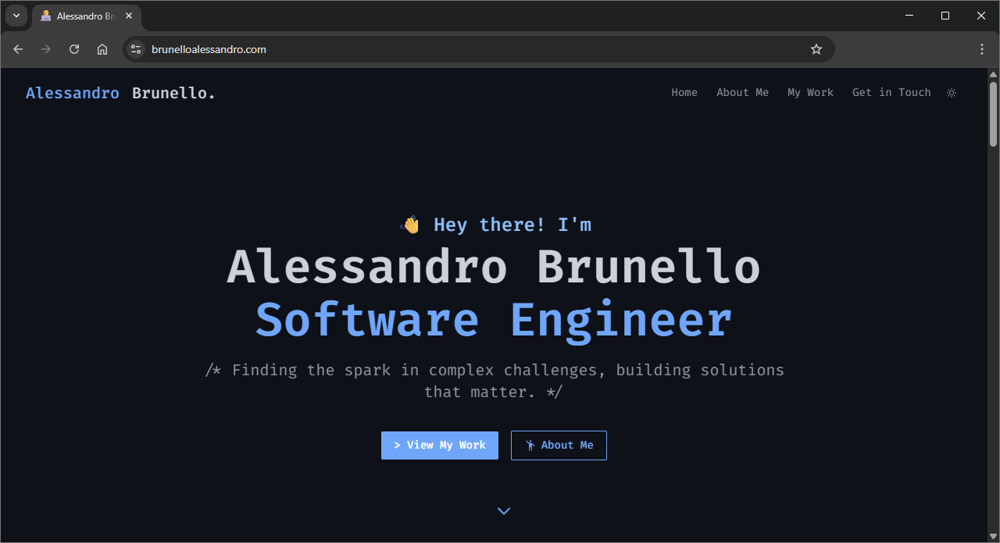

# 🌐 my_website

This is the source code for my personal portfolio website - a modern, responsive web application built with React, TypeScript, Tailwind CSS, and Vite. The site showcases my projects, skills, and professional experience with features like dark/light theme toggle, project showcase, and contact information.

## 🌐 Live Website

**View the live website**: [brunelloalessandro.com](https://brunelloalessandro.com)

## 📸 Website Preview



> Screenshot showing the homepage with dark theme enabled. Features the hero section, navigation, and project showcase.

## ⚡ Tech Stack
- **Frontend**: React 19, TypeScript
- **Styling**: Tailwind CSS, PostCSS
- **Build Tool**: Vite
- **Icons**: Custom SVG components

## 🚀 Quick Start

1. **Install dependencies**
   ```bash
   npm install
   ```

2. **Start development server**
   ```bash
   npm run dev
   ```
   Opens at `http://localhost:5173`

3. **Build for production**
   ```bash
   npm run build
   ```

4. **Preview production build**
   ```bash
   npm run preview
   ```

## 📁 Project Structure
```
src/
├── components/          # React components
│   ├── icons/          # SVG icon components
│   └── shared/         # Reusable UI components
├── constants.ts        # Site configuration and data
├── types.ts           # TypeScript type definitions
└── App.tsx            # Main application component
```

## ✨ Features
- 📱 Responsive design with mobile-first approach
- 🌙 Dark/light theme switching with localStorage persistence
- 🖼️ Project showcase with modal details
- 📧 Contact section with social links
- 🔗 Smooth scrolling navigation
- 🚀 Optimized images and performance
